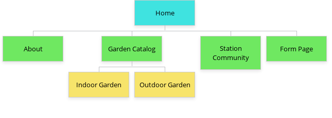

# Sprout & Grow Website Project

## Project description
 This website is a project for my Web Development Tools class. I'm tasked with creating a functional website for a fictitious company called Sprout & Grow, which represents a greenhouse nursery in Raleigh, NC. The company specializes in offering high-quality organic plants. 
 
## Project steps
The steps I'm following to create this project are:
- Create and follow the design brief requirements.
- Develop a sitemap:

- Sketch and design the 7 pages website.
- Code the project in HTML and CSS.
- Host the page on GitHub pages.

## What to do next
In process...

